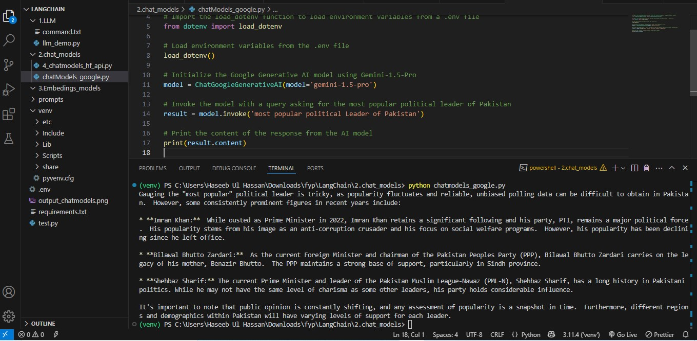

# LangChain Google Generative AI Example

This repository demonstrates how to integrate LangChain with Google's Generative AI using the Gemini-1.5-Pro model. The script loads API keys from a `.env` file, sends a query to the AI model, and prints the generated response.

## Repository Structure

- **chatModels_google.py**  
  Contains the code that initializes the Google Generative AI model, sends a query regarding Pakistan's most popular political leader, and prints the response.

- **requirements.txt**  
  Lists all the necessary dependencies to run the project.

## Prerequisites

- Python 3.7 or higher
- pip

## Setup Instructions

### 1. Clone the Repository

Clone this repository to your local machine:

```bash
git clone <repository-url>
cd <repository-folder>
```

### 2. Create and Activate a Virtual Environment (Optional but Recommended)

- **On macOS/Linux:**
  ```bash
  python3 -m venv venv
  source venv/bin/activate
  ```
- **On Windows:**
  ```bash
  python -m venv venv
  venv\Scripts\activate
  ```

### 3. Install Dependencies

Install the required libraries using the `requirements.txt` file:

```bash
pip install -r requirements.txt
```

### 4. Configure Environment Variables

Before running the script, you need to create an API key. You can create your API key by visiting [Google AI Studio Prompts](https://aistudio.google.com/prompts/new_chat), which is freely available. Save your API key in a `.env` file in the root directory of the repository, for example:

```env
HF_API_TOKEN="your_api_key_here"
```

> **Note:** Ensure you have the necessary API key from Google. The API key will be loaded into the script via the `.env` file.

## Running the Script

To run the project, execute the `chatModels_google.py` script:

```bash
python chatModels_google.py
```

The script will load your API key from the `.env` file, initialize the Gemini-1.5-Pro model, invoke the model with the query "most popular political Leader of Pakistan", and print the AI-generated response.

## About the Code

The code performs the following tasks:
- **Environment Setup:** Loads environment variables using `python-dotenv`.
- **Model Initialization:** Creates an instance of the `ChatGoogleGenerativeAI` model with Gemini-1.5-Pro.
- **Query Execution:** Invokes the model with a specific query regarding Pakistan's political landscape.
- **Output:** Prints the content of the response received from the model.




## License

This project is licensed under the MIT License.

## Contact

For any inquiries or further information, please contact [haseebulhassan1172003@gmail.com].
